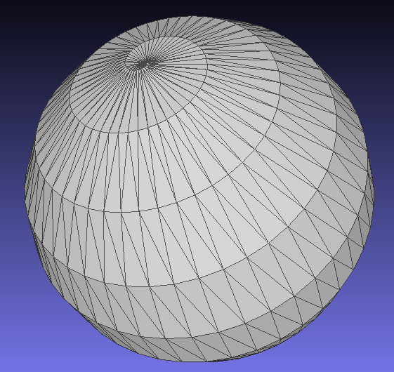
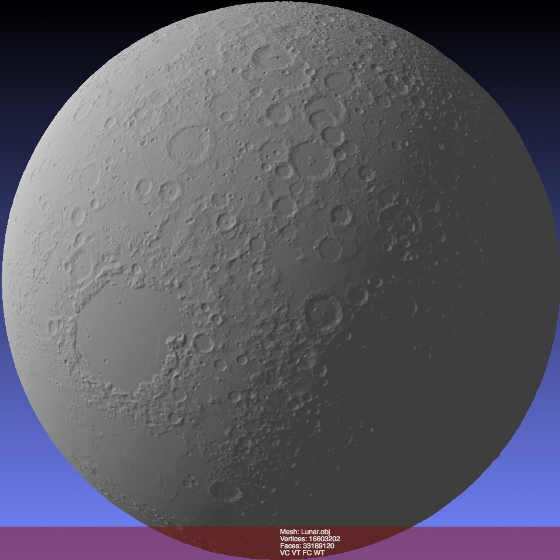
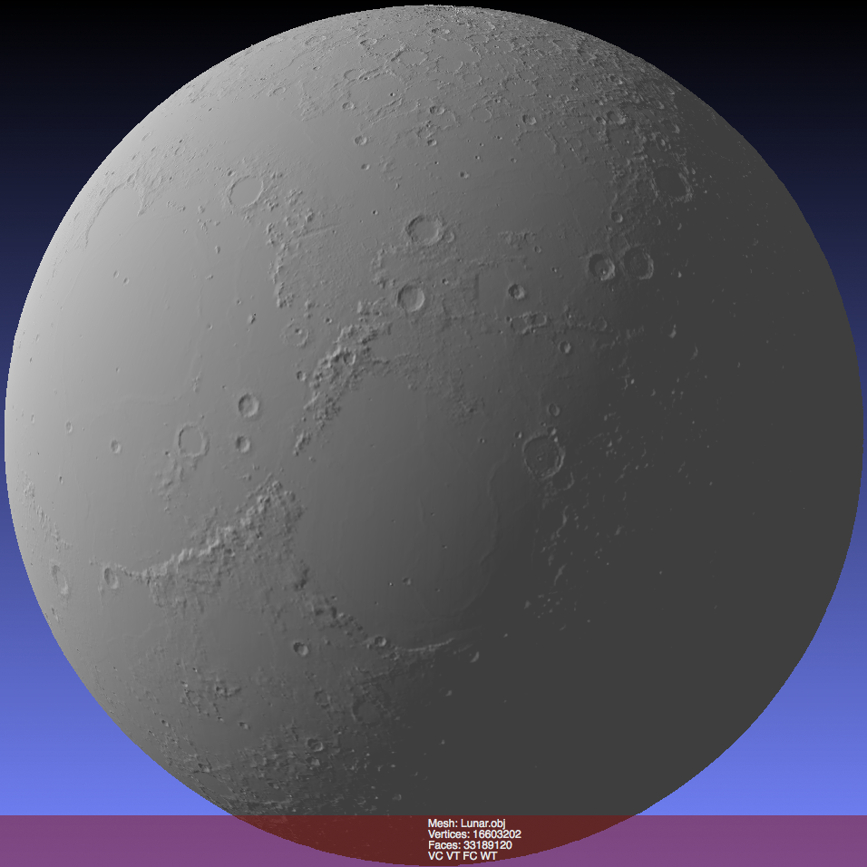
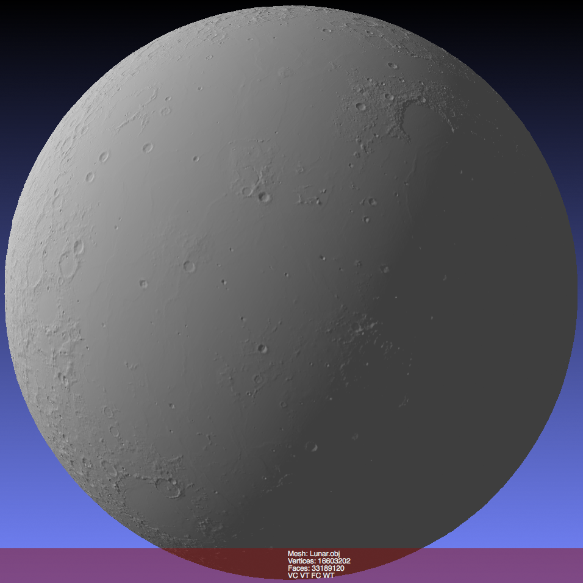

LunarGlobalShape
================
 球形メッシュの作成ツールです。
 現在2種類のプログラムが入っています。
 
  - [球面上の点群から球形メッシュを作成するツール](LunarGlobalShape) 
  - [月形状メッシュ作成ツール](LunarGridMesh)

# 点群から球形メッシュ作成
各行 "経度(0 ~ 360) 緯度(-90 ~ 90) 0(未使用)" の標準入力から、OBJ形式のメッシュを生成します。

## ビルドに必要なもの
C++ コンパイラ
[CGAL](http://doc.cgal.org/latest/Manual/installation.html) 64bit バージョンのインストールが必要です 
Boost

## 作成例

# 月形状メッシュ作成
「国立天文台 RISE月惑星探査検討室」の[月形状グリッドデータ](http://www.miz.nao.ac.jp/rise-pub/content/pub-data/topo_grid)を入力としてOBJ形式のメッシュを生成します。

# ビルドに必要なもの
C# コンパイラ

## 作成例

